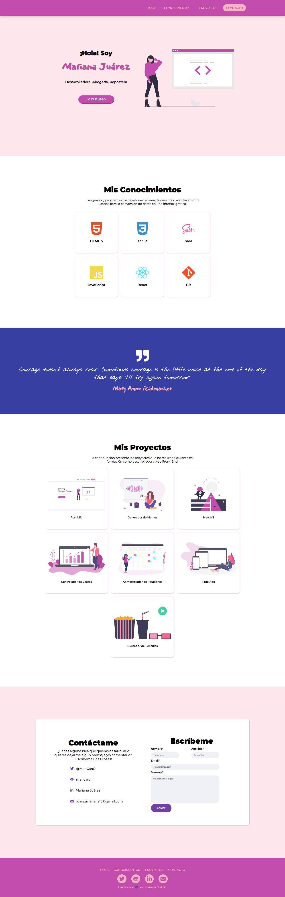

# Portafolio Mariana Juárez

Proyecto realizado como evaluación final del primer modulo del curso desarrollo FrontEnd, basado en la estructuración de un sitio Web usando **HTML** dándole estilos con lenguaje **CSS**. Aplicando buenas prácticas semánticas, lográndo desarrollar un sitio accesible y responsivo, como portafolio para presentar los futuros proyectos.

<br>

### ¡¡Acá puedes verlo andar!! Haz click en este [enlace](https://maricaroj.github.io/portafolio-mariana/), también puedes verlo [aquí](https://nervous-morse-f59ca4.netlify.app/)

### Para descargar el codigo en tus archivos, sigue estos pasos en tu terminal:🖥

- Ir al [repositorio](https://github.com/maricaroj/portafolio-mariana.git)
- Haz click en botón Fork
- Hacer click al botón de code
- Copiar la url del repositorio
- Abrir tu terminal ejecuta el comando
 ```git clone <url>```  
- Ubicarte en la carpeta del proyecto y abrirlo en tu IDE

**Voilà esta clonado el código** 🧙🏼‍♀️

---
***Este proyecto no necesita la instalación de ninguna dependencia.*** 📌

---
Así debes verlo cuando lo abras 👁 


<br>
<br>
<br>

## Thanks to:
- Mi querido profesor [Jonh Parra](https://github.com/Jonhks) 🇲🇽

---
Hecho con💜  por [Mariana Juárez](https://github.com/maricaroj)